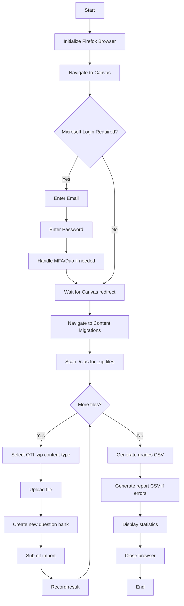

# CIA Grader 🎓

An automated Canvas LMS bot for uploading QTI (Question and Test Interoperability) files and generating grade reports. This tool streamlines the process of importing student quiz submissions into Canvas and tracking upload results.

---

## Table of Contents

-   [Overview](#overview)
-   [Features](#features)
-   [Prerequisites](#prerequisites)
-   [Installation](#installation)
-   [Directory Structure](#directory-structure)
-   [Usage](#usage)
    -   [Command Line Arguments](#command-line-arguments)
    -   [Examples](#examples)
-   [Supported Sections](#supported-sections)
-   [Input File Format](#input-file-format)
-   [Output Files](#output-files)
-   [Workflow](#workflow)
-   [Troubleshooting](#troubleshooting)

---

## Overview

The CIA Grader automates the tedious process of uploading multiple QTI quiz files to Canvas LMS. It uses browser automation (Playwright) to:

1. Log into Canvas via Microsoft/Azure AD authentication
2. Navigate to the course's content migration page
3. Upload each QTI `.zip` file as a question bank
4. Track upload success/failure for each student
5. Generate Canvas-compatible grade CSV files

---

## Features

-   ✅ **Automated Microsoft/Azure AD Login** - Handles UH single sign-on authentication
-   ✅ **Batch QTI Upload** - Uploads all `.zip` files from the `./cias` directory
-   ✅ **Anti-Detection Measures** - Uses browser fingerprint spoofing to avoid bot detection
-   ✅ **Multi-Section Support** - Works with DS1, DS2, and DSA courses
-   ✅ **Auto Question Bank Creation** - Creates question banks named after each file
-   ✅ **Grade CSV Generation** - Produces Canvas-compatible grade import files
-   ✅ **Error Reporting** - Generates detailed reports for failed uploads

---

## Prerequisites

Before using the CIA Grader, ensure you have:

1. **Python 3.8+** installed
2. **Playwright** browser automation library
3. **Required Python packages**:
    - `playwright`
    - `pandas`
    - `openpyxl`

---

## Installation

1. **Clone the repository** (if not already done):

    ```bash
    git clone <repository-url>
    cd CMAP-Grader/cia_grader
    ```

2. **Install Python dependencies**:

    ```bash
    pip install playwright pandas openpyxl
    ```

3. **Install Playwright browsers** (required first-time setup):

    ```bash
    playwright install firefox
    ```

4. **Create the `cias` directory** for your QTI files:
    ```bash
    mkdir cias
    ```

---

## Directory Structure

```
cia_grader/
├── README.md           # This documentation file
├── main.py             # Entry point - CLI interface
├── canvas_bot.py       # Core automation logic (CanvasBot class)
└── cias/               # Place your QTI .zip files here (create this folder)
    ├── studentname_12345_CIA1.zip
    ├── anotherstudent_67890_CIA1.zip
    └── ...
```

---

## Usage

### Command Line Arguments

```bash
python main.py <ASSIGNMENT> <SECTION> --email <EMAIL> --password <PASSWORD>
```

| Argument     | Required | Description                                       |
| ------------ | -------- | ------------------------------------------------- |
| `ASSIGNMENT` | ✅ Yes   | Assignment name (used as column header in grades) |
| `SECTION`    | ✅ Yes   | Section code: `DS1`, `DS2`, or `DSA`              |
| `--email`    | ✅ Yes   | Your UH/CougarNet email address                   |
| `--password` | ✅ Yes   | Your UH/CougarNet password                        |

### Examples

**Upload files for Data Science I (DS1), CIA1 assignment:**

```bash
python main.py CIA1 DS1 --email yourname@uh.edu --password yourpassword
```

**Upload files for Programming and Data Structures (DSA), CIA2 assignment:**

```bash
python main.py CIA2 DSA --email yourname@uh.edu --password yourpassword
```

**Upload files for Data Science II (DS2), Midterm assignment:**

```bash
python main.py Midterm DS2 --email yourname@uh.edu --password yourpassword
```

---

## Supported Sections

| Code  | Course ID | Course Name                                | Canvas Course URL                   |
| ----- | --------- | ------------------------------------------ | ----------------------------------- |
| `DS1` | 18978     | COSC3337 - Data Science I                  | https://canvas.uh.edu/courses/28570 |
| `DS2` | 20367     | COSC4337 - Data Science II                 | https://canvas.uh.edu/courses/28902 |
| `DSA` | 13434     | COSC2436 - Programming and Data Structures | https://canvas.uh.edu/courses/28568 |

---

## Input File Format

### QTI Zip Files

Place your QTI `.zip` files in the `./cias` directory. The bot parses student information from the filename.

**Recommended naming convention:**

```
studentname_canvasid_assignmentname.zip
```

**Examples:**

-   `johndoe_123456_CIA1.zip` → Student: johndoe, Canvas ID: 123456
-   `janesmith_789012.zip` → Student: janesmith, Canvas ID: 789012
-   `student_submission.zip` → Student: student_submission, Canvas ID: (none)

> **Note:** The Canvas ID should be the numeric student ID from Canvas, not the student's name or email.

---

## Output Files

After running, the bot generates two files in the current directory:

### 1. Grades CSV (`<ASSIGNMENT>_<SECTION>_grades.csv`)

A Canvas-compatible CSV for importing grades:

```csv
Student,ID,SIS User ID,SIS Login ID,Section,CIA1
Points Possible,,,,,100
johndoe,123456,,,COSC3337 18978 - Data Science I,100
janesmith,789012,,,COSC3337 18978 - Data Science I,100
```

**Grade Values:**

-   `100` = Successful upload
-   `0` = Failed upload

### 2. Report CSV (`<ASSIGNMENT>_<SECTION>_report.csv`)

A detailed report of any upload issues:

```csv
Student Name,Canvas ID,Score,Filename,Comments
failedstudent,111222,0,failedstudent_111222_CIA1.zip,Upload timeout error
```

> This file is only created if there were upload failures.

---

## Workflow

Here's the complete workflow when running the CIA Grader:



---

## Troubleshooting

### Common Issues

#### ❌ "Error: ./cias directory not found!"

**Solution:** Create the `cias` directory in the same folder as `main.py`:

```bash
mkdir cias
```

#### ❌ "No zip files found in ./cias directory!"

**Solution:** Ensure your QTI `.zip` files are placed in the `./cias` folder.

#### ❌ Login fails or times out

**Possible causes:**

-   Incorrect email or password
-   MFA/Duo authentication is required (approve on your phone)
-   Network issues

**Solutions:**

-   Double-check your credentials
-   Watch the browser window for MFA prompts
-   Ensure you're connected to the internet

#### ❌ "Unexpected page after import"

**Possible causes:**

-   Canvas UI has changed
-   Session timeout
-   Rate limiting

**Solutions:**

-   Try running again with fewer files
-   Check if Canvas is accessible manually
-   Contact support if issue persists

#### ❌ Browser closes unexpectedly

**Solution:** The bot takes an error screenshot (`error_screenshot.png`) if an error occurs. Check this file for clues.

---

## Environment Variables (Optional)

Instead of passing credentials via command line, you can set environment variables:

```bash
# Windows (PowerShell)
$env:CANVAS_EMAIL = "yourname@uh.edu"
$env:CANVAS_PASSWORD = "yourpassword"

# Linux/Mac
export CANVAS_EMAIL="yourname@uh.edu"
export CANVAS_PASSWORD="yourpassword"
```

> **Security Note:** For security reasons, it's recommended to use command-line arguments or environment variables rather than hardcoding credentials.

---

## Technical Details

### Anti-Detection Measures

The bot uses several techniques to avoid being detected as automation:

-   Custom Firefox user preferences
-   Spoofed user agent (macOS Firefox)
-   Disabled `navigator.webdriver` property
-   Human-like HTTP headers
-   Realistic viewport dimensions

### Dependencies

| Package      | Purpose                        |
| ------------ | ------------------------------ |
| `playwright` | Browser automation framework   |
| `pandas`     | Data manipulation (optional)   |
| `openpyxl`   | Excel file handling (optional) |
| `asyncio`    | Asynchronous I/O (built-in)    |
| `csv`        | CSV file handling (built-in)   |

---

## License

This project is for educational use at the University of Houston.

---

## Author

University of Houston - COSC Department

---

## Support

If you encounter issues not covered in this documentation:

1. Check the error screenshot if available
2. Review the console output for error messages
3. Ensure all prerequisites are installed correctly
4. Verify your Canvas course access permissions
